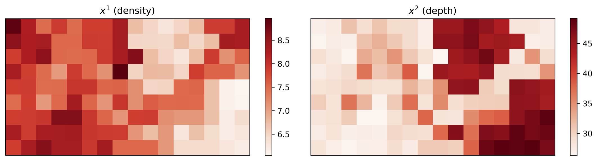
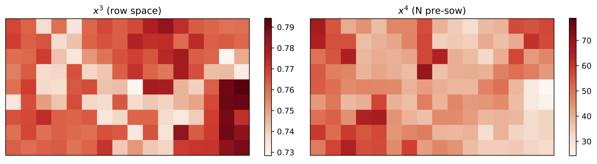
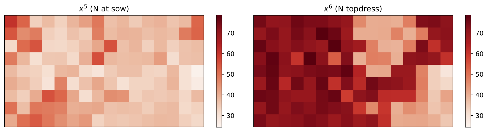

# Machine learning for optimizing complex site-specific management
by Yuji Saikai, [Vivak Patel](http://pages.stat.wisc.edu/~vrpatel6/), and [Paul D. Mitchell](https://aae.wisc.edu/faculty/pdmitchell/)

Once I finish cleaning up the Python code, it will appear here!

**Abstract**

Despite the promise of precision agriculture for increasing the productivity by implementing site-specific management, farmers remain skeptical and its utilization rate is lower than expected. A major cause is a lack of concrete approaches to higher profitability. When involving many variables in both controlled management and monitored environment, optimal site-specific management for such high-dimensional cropping systems is considerably more complex than the traditional low-dimensional cases widely studied in the existing literature, calling for a paradigm shift in optimization of site-specific management. We propose an algorithmic approach that enables farmers to efficiently learn their own site-specific management through on-farm experiments. We test its performance in two simulated scenarios---one of medium complexity with 150 management variables and one of high complexity with 864 management variables. Results show that, relative to uniform management, site-specific management learned from 5-year experiments generates $43/ha higher profits with 25 kg/ha less nitrogen fertilizer in the first scenario and $40/ha higher profits with 55 kg/ha less nitrogen fertilizer in the second scenario. Thus, complex site-specific management can be learned efficiently and be more profitable and environmentally sustainable than uniform management.

[[manuscript](bopa.pdf)]

&nbsp;

**Learned site-specific management**

