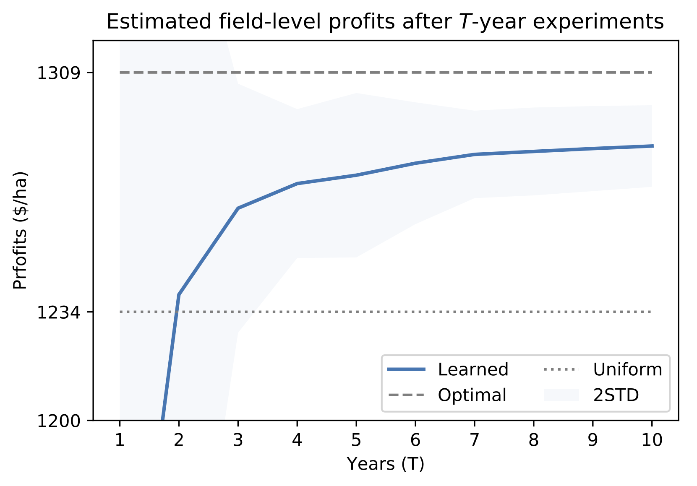

# Machine learning for optimizing complex site-specific management
by Yuji Saikai, [Vivak Patel](http://pages.stat.wisc.edu/~vrpatel6/), and [Paul D. Mitchell](https://aae.wisc.edu/faculty/pdmitchell/)

**Abstract**

Despite the promise of precision agriculture for increasing the productivity by implementing site-specific management, farmers remain skeptical and its utilization rate is lower than expected. A major cause is a lack of concrete approaches to higher profitability. When involving many variables in both controlled management and monitored environment, optimal site-specific management for such high-dimensional cropping systems is considerably more complex than the traditional low-dimensional cases widely studied in the existing literature, calling for a paradigm shift in optimization of site-specific management. We propose an algorithmic approach that enables each farmer to efficiently learn their own site-specific management through on-farm experiments. We test its performance in two simulated scenarios of low complexity with 150 management variables and of high complexity with 864 management variables. Our results show that the learned site-specific management from, for example, 5-year experiments generates $43/ha higher profits with 25 kg/ha less nitrogen fertilizer in the first scenario and $40/ha higher profits with 56 kg/ha less nitrogen fertilizer in the second scenario than the benchmark uniform management. Thus, complex site-specific management can be learned very efficiently, which is indeed more profitable and environmentally sustainable than uniform management.

[[pdf](bopa.pdf)]

